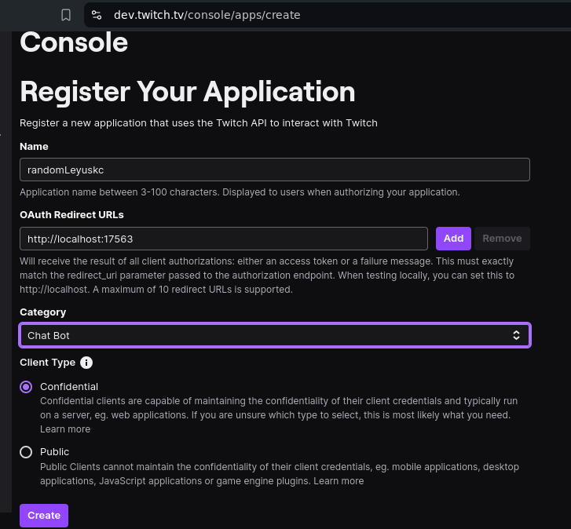
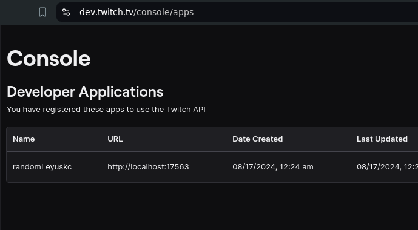
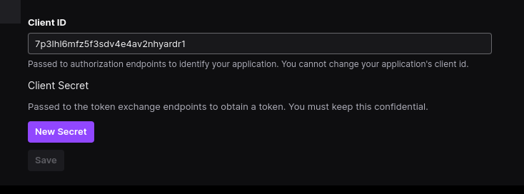
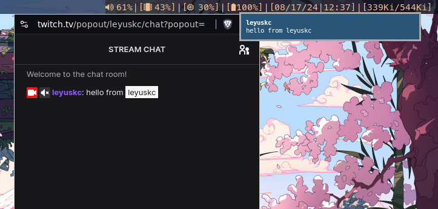

# TwitchApi Wrapper
this is a basic twitch api wrapper

example
```py
# original twitch api,  pip install twitchAPI

from twitchAPI.chat import ChatCommand, ChatMessage, ChatSub
from twitchAPI.type import AuthScope

# twitchApi dirty wrapper
#  here twitch is the twitch.py in this repo
from twitch import TwitchTv

#  initialize twitchTv
twitch_bot = TwitchTv(
    app_id=APP_ID,
    app_secret=APP_SECRET,
    channel_name=TARGET_CHANNEL,
    user_scope=USER_SCOPE,
    save_auth=True,
)


@twitch_bot.on_message
async def on_message(msg: ChatMessage):
    print(msg.user.name, msg.text)

@twitch_bot.on_sub
async def on_sub(sub: ChatSub):
    print(
        sub.chat.username if sub.chat.username else "",
        sub.sub_message)

@twitch_bot.command(command_name="reply")
async def test_command(cmd: ChatCommand):
    if len(cmd.parameter) == 0:
        await cmd.reply("you did not tell me what to reply with")
    else:
        await cmd.reply(f"{cmd.user.name}: {cmd.parameter}")

@twitch_bot.command(command_name="stop")
async def stop_bot(cmd:ChatCommand):
    if len(cmd.parameter)==0:
        return
    if cmd.user.name == "originaluser" and cmd.parameter[0] == "secret":
        twitch.stop()

# to start bot 
# this will start a event loop 
# so anything below it won't execute
twitch.start()

# to stop the bot, you can do twitch.stop()
# twitch.stop()
```


## Note It requires [twitchApi](https://pypi.org/project/twitchAPI/)
```bash
pip install twitchAPI
```
As its a simple wrapper on top of twitchApi, to make it simpler to use 


## how to use
1. clone the repo
2. copy `.env.example` -> `.env`
3. Fill the necessary data in `.env` from [twitch dev console](https://dev.twitch.tv/console/apps/create)
    > OAuth Redirect URLs must be ```http://localhost:17563```
    
4. Now goto [apps section](https://dev.twitch.tv/console/apps)
    > and click on `Manage`
    
5. Scroll down and you should see  `Client ID` and `Client Secret`
    

6. Copy `Cient ID` and past to `.env` -> `ID`
7. Click on `Client Secret` and it will give you ontime access to a secrete key
    copy that and paste to `.env` -> `CODE`

## Note:- the main.py in this repo is for personal use and demo purpose
> For it to work on your machine it needs to satisfy these things
1. it is unix like system (macos,ubuntu,debain,arch... linux/unix distros)
2. it must haev `notify-send` installed and setuped,
3. (optional) if your system is `windows` then you can change the `notidy-send`
    command to other notificaion sending commands that can be installed in windows

## now what does main.py do
> it sends notificaiton on my system when new chat message is their in twitch live
> as their are few chatters in my [live](twitch.tv/leyuskc) and checking on chat regularly
> is to much time waste for me, and not replying to chat is bad, so it's a solution 
> for a specific purpose

